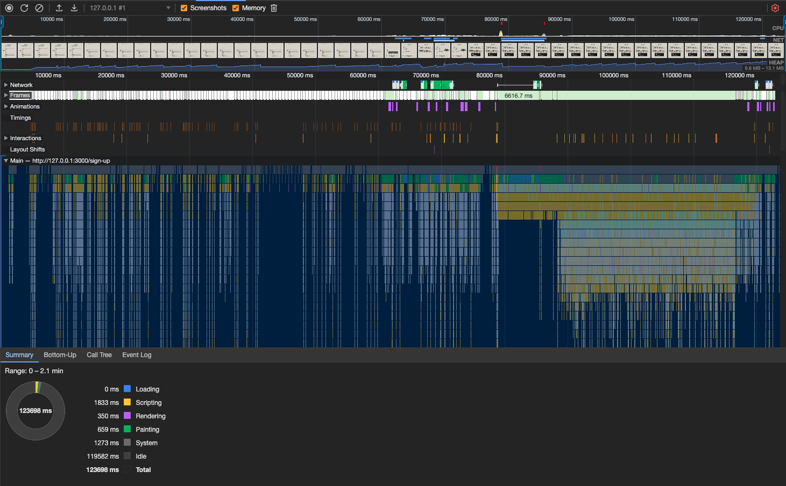

# Отчет о Памяти и Утечках

## Замеры во вкладке Performance и React DevTools

В процессе разработки данного проекта был проведен тщательный замер производительности и утечек памяти с использованием инструментов встроенных в браузер, таких как **Chrome DevTools**, а также **React DevTools**.

## Результаты анализа

С помощью Recorder произведена запись сымитированного пользовательского сценария: регистрация -> посещение всех страниц -> игра -> выход из профиля.

**Утечек памяти не обнаружено:** Все тесты и анализ не выявили никаких утечек памяти на странице игры. Это подтверждается как результатами профайлера в Chrome DevTools, так и визуальным анализом React DevTools.

## График производительности

## Дальнейшие рекомендации

На основе результатов замеров, на текущий момент, страница игры не демонстрирует утечек памяти. Однако, рекомендуется продолжать регулярный мониторинг производительности и профилирование, особенно при добавлении новых функций и изменениях в коде.